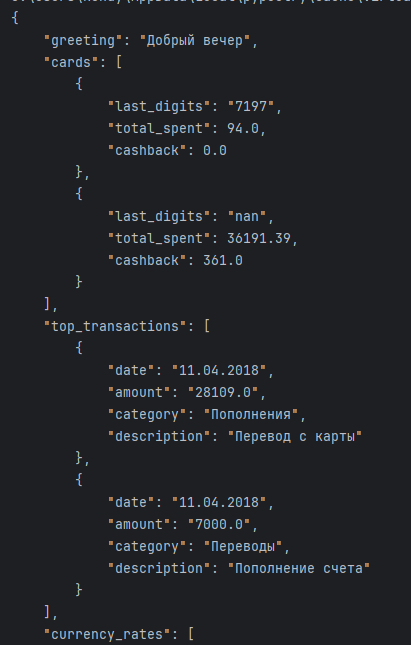
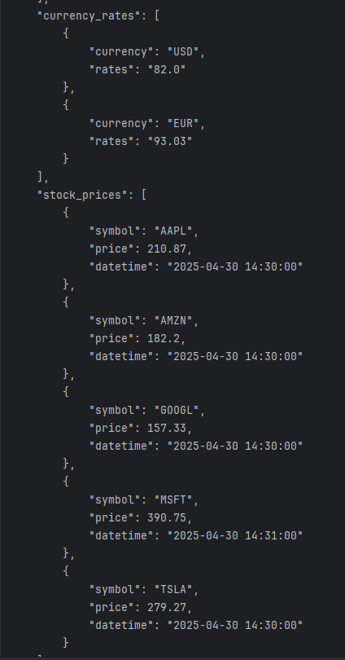
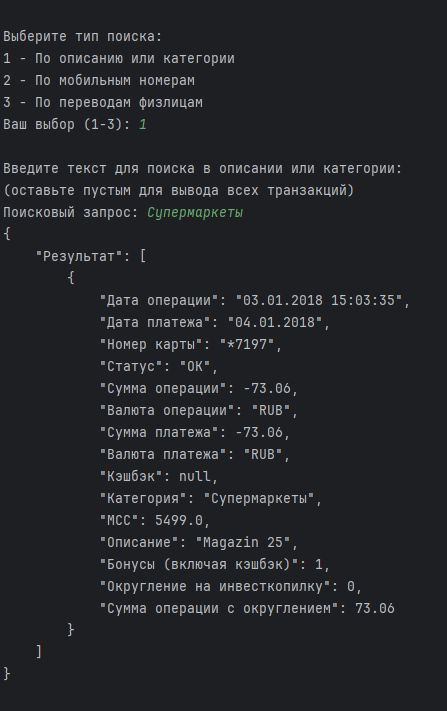
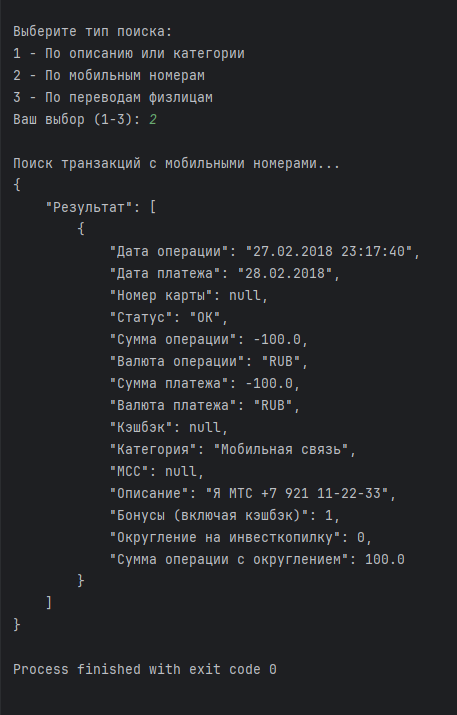
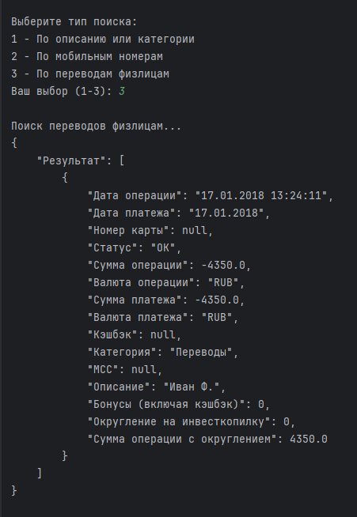
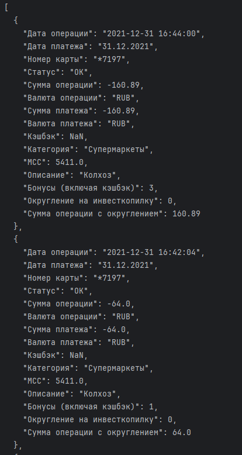

# КУРСОВАЯ РАБОТА №1: Приложение для анализа банковских операций


# **Описание**

## Данный проект реализует анализ данных, используя 3 модуля:
### 1. Главная страница
### 2. Фильтрация транзакций по описанию или категории | по номеру телефона | по переводам физ лицам
### 3. Функция фильтрации трат по категориям


# **Установка**:

### Для работы приложения необходимо установить интерпретатор *poetry*:

```pip install --user poetry```

### Так же клонируйте репозиторий:

```git clone https://github.com/Konstantin-Voronin-23/Project1.git```


# **Установка зависимостей**:

### Для работы проекта воспользуйтесь командами для установок зависимостей:

```
poetry add --group lint flake8
poetry add --group lint mypy
poetry add --group lint black
poetry add --group lint isort

poetry add --group dev pytest
poetry add --group dev pytest-cov
poetry add python-dotenv
poetry add requests
poetry add pandas
poetry add openpyxl
```
# **Реализация модулей**:

## 1. Модуль Utils - модуль для вспомогальных функций, в нем реализованы :

<details>
<summary><b>❗ ФУНКЦИИ ❗</b></summary>

  ### - Функция get_time_for_greeting :
    - Функция возвращает приветствие «Доброе утро» / «Добрый день» / «Добрый вечер» / «Доброй ночи»
    в зависимости от текущего времени
  ### - Функция get_data_time :
    - Функция изменения формата даты и времени
  ### - Функция get_path_and_period :
    - Функция принимает путь к Excel файлу и список дат, и возвращает табилицу в заданном периоде
  ### - Функция get_card_with_spend :
    - Функция принимает DataFrame и возвращает список карт с расходами
  ### - Функция git_top_transaction :
    - Функция принимает DataFrame и возвращает топ-транзакций по сумме платежа
  ### - Функция get_currency :
    - Функция принимает на вход path_to_json и возвращает курс валют
  ### - Функция get_stock :
    - Функция принимает на вход path_to_json и возвращает курс акций
 ###  - Функция simple_search :
    - Простой поиск по описанию или категории
  ### - Функция find_mobile_payments :
    - Поиск транзакций с мобильными номерами в описании
  ### - Функция find_person_transfers :
    - Поиск переводов физическим лицам

</details>

## 2. Модуль Views - это главная страница, она принимает вспомогательные функции и собирает их вместе

### - Функция main_info :
    - Функция и главная функция, принимающая на вход строку с датой и временем в формате YYYY-MM-DD HH:MM:SS
    и возвращающую JSON-ответ
    - Функция принимает | Приветствие |Расходы по каждой карте | Топ-5 транзакций по сумме платежа | Курс валют | Стоимость акций из S&P500 |
    - Функция использует get_time_for_greeting | get_card_with_spend | git_top_transaction | get_currency | get_stock

<details>
<summary><b>❗ ПРИМЕР ❗</b></summary>




</details>

## 3. Модуль Services - это страница сервисов, она принимает вспомогательные функции и собирает их вместе

### - Функция main_services :
    - Функция которая принимает путь до EXCEL файла, и реализует три поисковика тразанкций на выбор,
      по описанию или категории | по мобильному номеру в описании | по переводам физ лицам
    - Функция принимает Поиск по описанию/категории | Поиск по мобильному номеру в описании | Поиск по переводам физ лицам
    - Функция использует simple_search | find_mobile_payments | find_person_transfers

<details>
<summary><b>❗ ПРИМЕРЫ ❗</b></summary>





</details>

## 4. Модуль Reports - это страница отчетов, в ней реализованы :

### - Декоратор spending_by_category :
    - Декоратор для фильтрации транзакций по категории и дате
    - Принимает дату и название категории

### - Функция get_dataframe :
    - Функция читающая excel файл и возвращающая DataFrame с транзакциями
    - Принимает путь до excel файла

<details>
<summary><b>❗ ПРИМЕР ❗</b></summary>



</details>

# **Тесторирование модулей**:

<details>
<summary><b>❗ МОДУЛЬ UTILS ❗</b></summary>

### test_get_time_for_greeting
  - Тест проверяет корректность возвращаемого приветствия в зависимости от времени суток
### test_get_data_time
  - Тест проверяет корректность преобразования формата даты и времени,
        а также правильность вычисления начала месяца
### test_get_path_and_period
  - Тест проверяет корректность фильтрации данных по периоду дати правильность сортировки результатов
### test_get_card_with_spend
  - Тест проверяет корректность: |Фильтрации только расходных операций| Форматирования номеров карт
        | Расчет кэшбэка
### test_git_top_transaction
  - Тест проверяет: |Корректность выбора топ-N транзакций| Правильность сортировки по сумме (по убыванию)
        | Формат возвращаемых данных
### test_get_currency
  - Тест проверяет: | Корректность работы с API (запрос и обработка ответа)| Парсинг JSON файла с валютами
        | Формат возвращаемых данных
### test_get_stock
  - Тест проверяет: | Корректность работы с Twelve Data API| Парсинг JSON файла с акциями
        | Формат возвращаемых данных
### test_simple_search
  - Тест проверяет: | Поиск по описанию транзакции| Поиск по категории транзакции
        | Регистронезависимость поиска
### test_find_mobile_payments
  - Тест проверяет корректность поиска транзакций с номерами телефонов в описании.
        Должны находиться номера в различных форматах (+7, 8, 7)
### test_find_person_transfers
  - Тест проверяет корректность поиска переводов физическим лицам:
        1. Категория должна быть "Переводы"
        2. В описании должен быть шаблон имени (Фамилия И.О.)

</details>

<details>
<summary><b>❗ МОДУЛЬ VIEWS ❗</b></summary>

### test_main_info_basic
  - Тест на проверку корректности работы программы
### test_main_info_empty_data
  - Тест на проверку, что программа корректно отрабатывает если приняты пустые данные
### test_main_info_error
  - Тест отработки ошибок

</details>

<details>
<summary><b>❗ МОДУЛЬ SERVICES ❗</b></summary>

### test_main_services_choices
  - Параметризованный тест для проверки различных вариантов выбора пользователя
### simple_search_integration
  - Тест поиска по описанию
### test_main_services_with_patched_input
  - Тест с подменой пользовательского ввода
### test_invalid_choice
  - Тест обработки неверного выбора пользователя

</details>

<details>
<summary><b>❗ МОДУЛЬ REPORTS ❗</b></summary>

### test_spending_by_category_decorator
  - Тест для декоратора spending_by_category
### test_get_dataframe_error
  - Тест для обработки ошибок в get_dataframe
### test_spending_by_category_empty_df
  - Тест для пустого DataFrame
### test_spending_by_category_no_params
  - Тест для декоратора без параметров

</details>

# Покрытие тестами 99%

# Документация

# Лицензия

## - Этот проект лицензирован по [лицензии MIT](LICENSE).